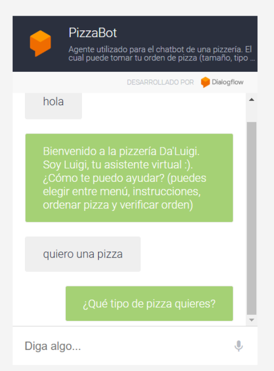

# dialogflow-chatbot
This project is an example of a chatbot implementation for a pizza ordering system. It uses Google's Dialogflow for natural language understanding and a Node.js backend that acts as a webhook to manage order logic and fulfillment. The chatbot can be integrated with various platforms, such as Telegram or a web client.

### Chatbot Flow Diagram

### Web Client Example

### Telegram Client Demo Video

